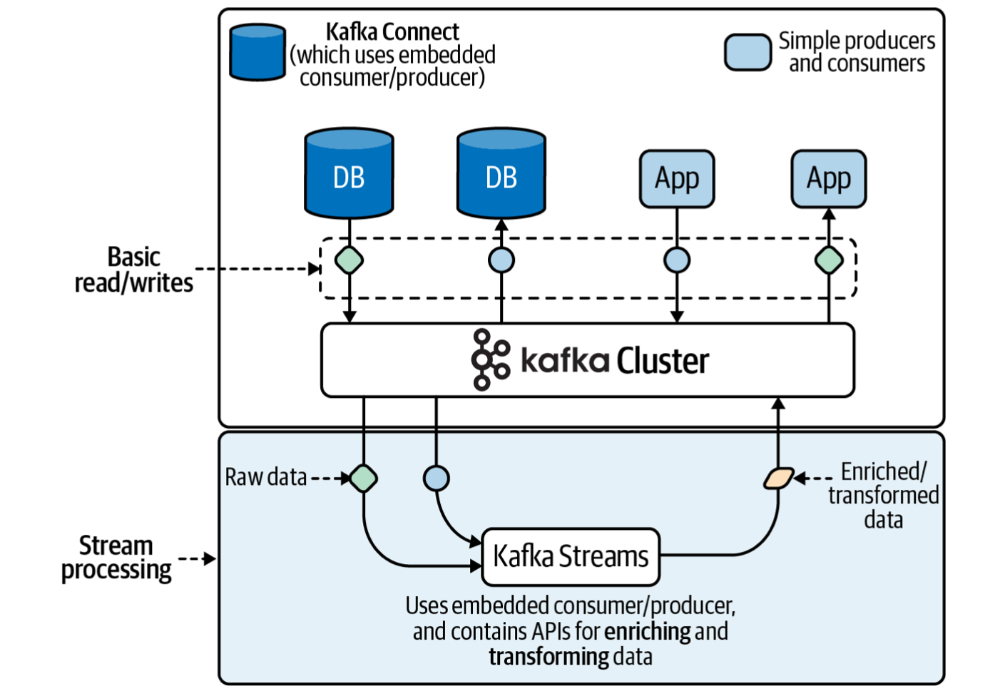

# Kafka

## Installation

1. Download the binary from https://kafka.apache.org/downloads

2. Run a dummy test:

```bash
$ ./bin/kafka-storage.sh random-uuid
IFFFDzvqQPeL7t6Z5h09fg

$ ./bin/kafka-storage.sh format -t IFFFDzvqQPeL7t6Z5h09fg -c ./config/kraft/server.properties
Formatting /tmp/kraft-combined-logs

$ ./bin/kafka-server-start.sh ./config/kraft/server.properties

$ ./bin/kafka-topics.sh --create --topic foo --partitions 1 --replication-factor 1 --bootstrap-server localhost:9092
Created topic foo.

$ ./bin/kafka-console-producer.sh --topic foo --bootstrap-server localhost:9092
>test message

$ ./bin/kafka-console-consumer.sh --topic foo --bootstrap-server localhost:9092 --from-beginning
test message
````

## Kafka streams

<p float="left">
    
</p>

1. Create a new Gradle project:

```bash
$ gradle init --type java-application --dsl groovy --test-framework junit --project-name kafka_streams_demo --package com.example
```

2. Build the project:

```bash
$ ./gradlew build
```

3. Process the events generated by `kafka-console-producer` by one of the following tasks:

```bash
$ ./gradlew runDSL --info
$ ./gradlew runProcessorAPI --info
```

## References

* https://www.confluent.io/blog/kafka-without-zookeeper-a-sneak-peek/
* https://github.com/apache/kafka/blob/6d1d68617ecd023b787f54aafc24a4232663428d/config/kraft/README.md
* https://github.com/confluentinc/schema-registry
* https://github.com/protocolbuffers/protobuf
* https://kafka.apache.org/documentation/
* https://docs.confluent.io/platform/current/schema-registry/develop/api.html
* https://docs.ksqldb.io/en/latest/how-to-guides/
* https://docs.spring.io/spring-kafka/docs/current/reference/html/
* https://javalin.io/
* https://square.github.io/okhttp/
